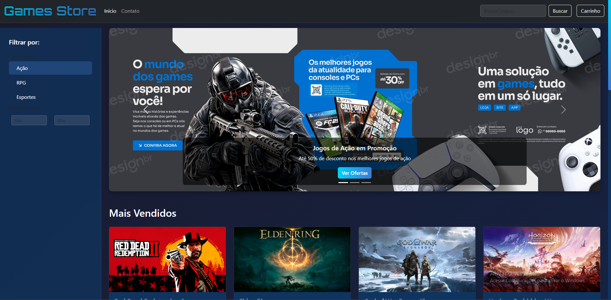
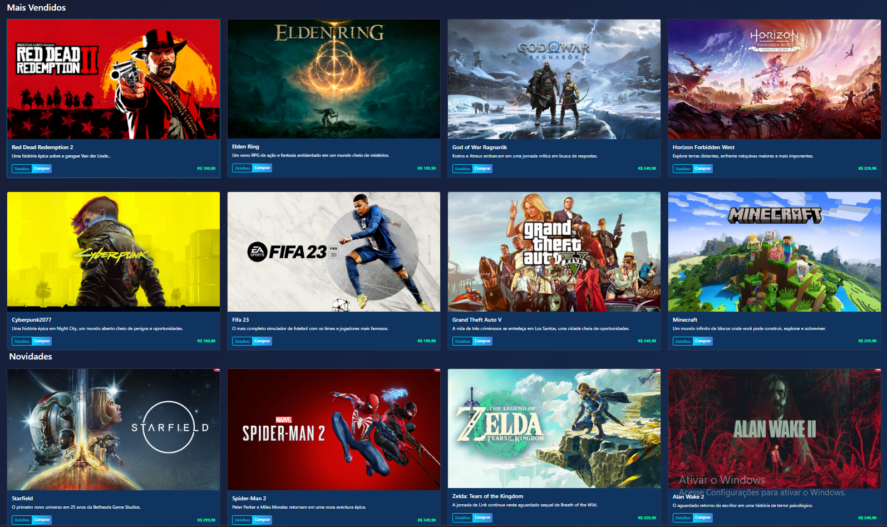
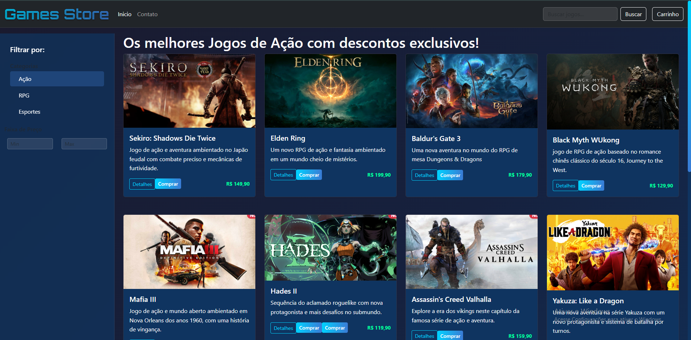
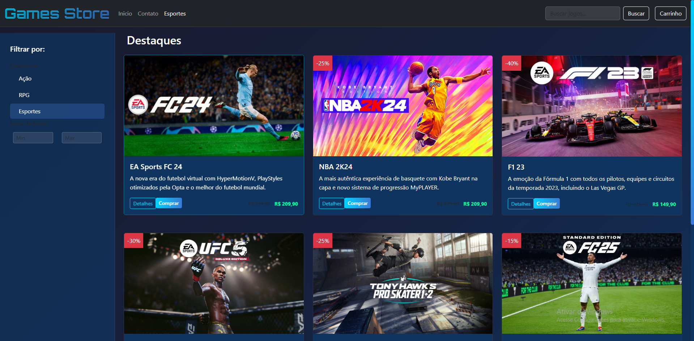
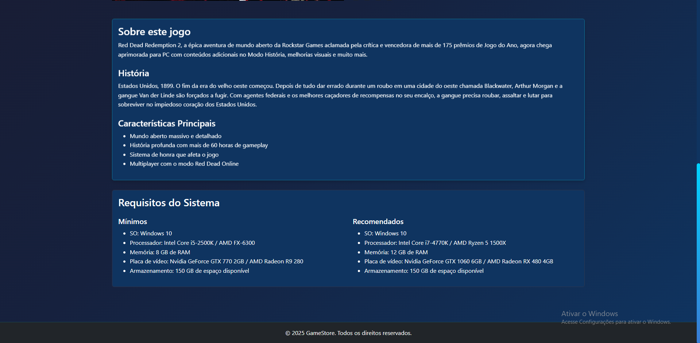
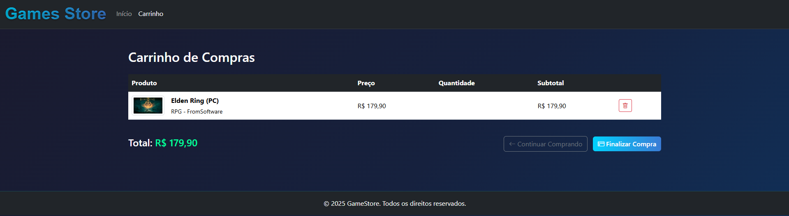
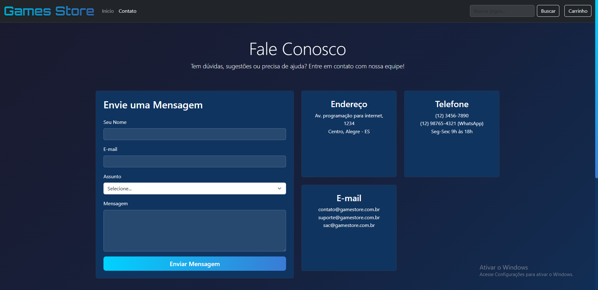
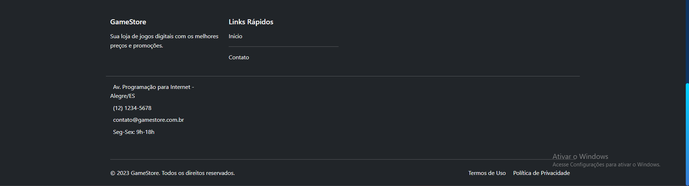

# Loja de jogos E-Commerce - Trabalho Cleziel



## Descrição 📋
Este projeto tem como objetivo o desenvolvimento de um template completo e profissional de e-commerce de jogos.

## Features 🔥

Funcionalidades modernas e bem estruturadas que oferecem uma experiência completa ao usuário:

- *Header global responsivo*
- *Banner rotativo (carrossel)*
- *Footer avançado*
- *Depoimentos*
- *Catálogo de Produtos*
- *Seção “Mais Vendidos”*
- *Seção “Novidades”*
- *Sidebar de Categorias*
- *Detalhe de Produto*
- *Carrinho de Compras*
- *Newsletter*

## Prints 📸
















## 🛠 Tecnologias, frameworks e ferramentas utilizadas

### Tecnologias 🧱
- HTML
- CSS
- JavaScript

### 📦 Frameworks e bibliotecas
- Bootstrap

### 🧰 Ferramentas
- Visual Studio Code
- Live Server 
- GitHub
- Google Fonts

## 📁 Estrutura de Pastas

```bash
\---e-commerce
    |   acao.html
    |   AlanWake.html
    |   assassins.html
    |   aventura.html
    |   baldursgate3 copy.html
    |   baldursgate3.html
    |   blackmyth copy.html
    |   blackmyth.html
    |   carrinho.html
    |   contato.html
    |   cyberpunk.html
    |   elderring.html
    |   esportes.html
    |   fifa.html
    |   godofwar.html
    |   gtaV.html
    |   hades2.html
    |   horizon.html
    |   index.html
    |   mafia3.html
    |   mine.html
    |   red dead.html
    |   sekiro.html
    |   spiderman.html
    |   starfield.html
    |   yakuza.html
    |   zelda.html
    |
    +---css
    |       bootstrap.css
    |       style.css
    |
    +---img
    |       Alanwake2.webp
    |       assassins creed valhalla.jpg
    |       assassins.jpg
    |       baldurs gate3.jpg
    |       baldurs_gate_3-01.jpg
    |       bg3.avif
    |       blackmw.jpg
    |       EGS_Cyberpunk2077.jpeg
    |       elder ring.jpg
    |       f1 23.jpg
    |       fc24.avif
    |       fc25.jpg
    |       fifa.jpg
    |       god.jpg
    |       gta.jpeg
    |       hades2.jpg
    |       horizon.jpeg
    |       imagem1.jpg
    |       imagem2.jpg
    |       imagem3.jpg
    |       mafia3.jpg
    |       mine.jpg
    |       nba24.jpg
    |       pessoa1.jpeg
    |       pessoa2.jpeg
    |       pessoa3.jpeg
    |       pessoa3.jpg
    |       pessoa4.jpeg
    |       red dead.jpg
    |       resident4.jpg
    |       sekiro.jpg
    |       spider man.webp
    |       spiderman2.jpg
    |       starfield.jpg
    |       tony haws.jpg
    |       ufc5.avif
    |       yakuza.jpg
    |       zelda.jpg
    |
    \---js
            bootstrap.bundle.js
            scripty.js 
```
## Instalação 💡

Para rodar o site localmente, siga os passos abaixo:

1. Clone o repositório:

   ```bash
   git clone https://github.com/Leonan-soares/e-commerce.git
   ```

2. Navegue até o diretório do projeto:

   ```bash
   cd e-commerce
   ```

3. Instale às dependências:

   ```bash
   npm install
   ```

4. Inicie o site:

   ```bash
   npm start
   ```

5. Acesse seu navegador e entre na url `http://localhost:3000`.

### Desições de design✅
O design deste projeto foi inspirado nas páginas web de grandes plataformas de jogos como Steam, Epic Games, Nuuvem e PlayStation Store. Utilizando os recursos do Bootstrap, foi possível implementar componentes como carrossel, sidebar, header e footer, resultando em uma interface simples, moderna e dinâmica.
Links dos sites: 
- [Steam](https://store.steampowered.com)
- [Epic Games](https://store.epicgames.com)
- [Nuuvem](https://www.nuuvem.com)
- [Playstation Store](https://store.playstation.com/)
